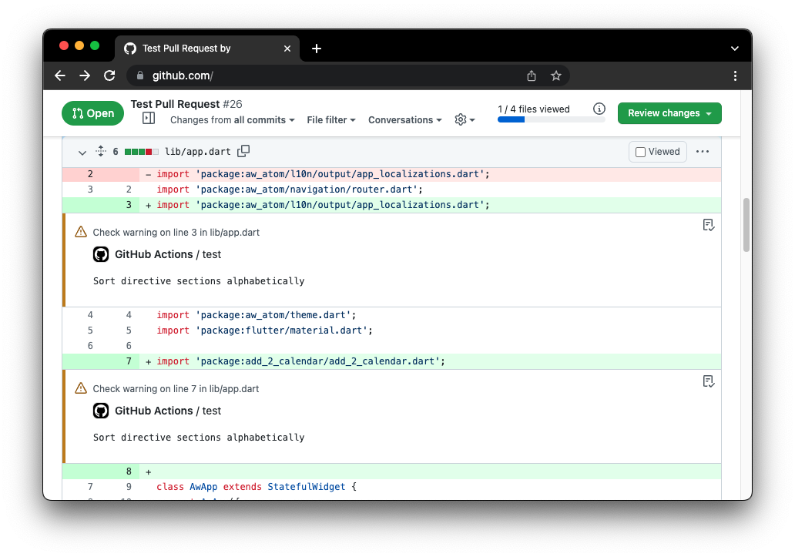

# dart-problem-matcher


A GitHub Action that annotates your Dart (or Flutter) analyzer warnings and errors and helps you spot them right in the code.



## Usage

Simply add the step somewhere above your `dart/flutter analyze` in your steps list in GitHub Workflow:

```yaml
jobs:
  test:
    steps:
      - uses: leancodepl/dart-problem-matcher@main

      - run: dart analyze # or flutter analyze
      # other steps...
```

## Known limitations

* [GitHub Problem Matchers](https://github.com/actions/toolkit/blob/main/docs/problem-matchers.md) allow only up to 10 warning and 10 error annotations per step.
* Only analyzer's `warning` and `error` severity problems will be annotated, `info` will be not.